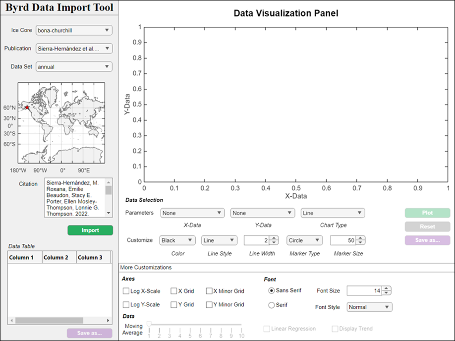

# **Documentation**

## Table of Contents

- [About](#about)
- [Timeline of major changes](#timeline-of-major-changes)
- [Tutorial](#tutorial)
   - [How to open the app](#how-to-open-the-app)
   - [Selecting a data set](#selecting-a-data-set)
   - [Visualizing data](#visualizing-data)
   - [Exporting data](#exporting-data)
- [Report an issue](#report-an-issue)

## About
For over 40 years the Byrd Polar and Climate Research Center (henceforth the "Byrd Center") has pioneered the drilling of high-altitude, low-latitude ice cores. During this time, the Byrd Center has published a wide range of ice core data sets with a global coverage of more than 16 countries across 6 continents.

The majority of these data sets have been made freely available through the NOAA WDS Paleoclimatology archive (https://www.ncei.noaa.gov/access/paleo-search). However, over the course of many decades data formatting standards and the diversity of Byrd Center authors has varied considerably, making it a very inefficient process to find, access, download, visualize, and compare the data sets for one or multiple ice core records.

To improve the accessibility of these crucial data sets for researchers worldwide, a standardized data format has been adopted and applied to 80+ data sets across more than a dozen ice core records and 30+ peer-reviewed publications. The Byrd Data Import Tool (or `ByrdDIT`) provides easy access to these data through a user-friendly MATLAB application.

## Timeline of major changes
* **May 2026** - Version 4.0 release.
* **August 2025** - Version 3.1 release.
* **August 2024** - Version 3.0 release.
* **December 2023** - Version 2.3 release.
* **October 2023** - Versions 2.0-2.2 released as open source tools.

## Tutorial
### How to open the app
Once the repository is properly installed (see [`INSTALLATION.md`](https://github.com/weber1158/ByrdDIT/docs/INSTALLATION.md) for details), you can open the Byrd Data Import Tool by executing the following command:

```matlab
ByrdApp
```

That's it! The home page for Version 4.0 should look like this:



### Selecting a data set
1. Select one of the options from the **Ice Core dropdown** menu in the lefthand panel.

   - A red star will appear in the map window indicating the approximate location of where the ice core was drilled.

2. The **Publication dropdown** menu should auto-populate with relevant research publications after a few seconds. Select the publication that you would like to work with.

   - Selecting a publication will update the **Citation text area** below the map window.

3. The **Data Set dropdown** menu will auto-populate with the selection of a publication. Choose the data set you want to import and then click the green **Import button**.

   - The **Data Table** will display the relevant data from the selected data set upon import.

### Visualizing data
After completing the steps above, you can visualize the imported data within the **Data Visualization Panel**.

Just below the figure window is a series of dropdown menus labeled **Parameters**. Select from the `X-Data` and `Y-Data` dropdown menus to choose which data you want to plot. 

All other dropdown menus and interactive tools are optional, but are very helpful for customizing your visualization. After you are finished making you selections, click the green **Plot button** to display the data in the figure window.

Use the **Clear button** to reset the entire **Data Visualization Panel**.

The **More Customizations panel** at the bottom of the app allows you to adjust the appearance of the figure window without needing to replot. This panel contains some useful features, for example:

   - The **Moving Average slider** will dynamically adjust the x-axis data by applying a moving average operation to the independent variable.
   - The **Linear regression** and **Display Trend** checkboxes will fit a first-order polynomial model to the data and print the equation of the line in the upper lefthand corner of the chart.

### Exporting data
You can save the raw data by clicking the purple **Save as...** button beneath the **Data Table**. You will be prompted to select a file type (`.xlsx`, `.csv`, or `.txt`) and then you will be prompted to choose the file path where you want the data to be saved. 

Similarly, you can save the current figure by clicking the purple **Save as...** button below the **Data Visualization Panel**. You will be prompted to select a file type (`.jpeg`, `.png`, or `.tif`) and then you will be prompted to choose the file path where you want the data to be saved. The image will be saved with a DPI of 300.

## Report an issue
If you would like to report an error or file a feature request, please open a new issue on the [**Issues page**](https://github.com/weber1158/ByrdDIT/issues).

For general questions or disscussion, you can open a new discussion on the [**Disucussions page**](https://github.com/weber1158/ByrdDIT/discussions).