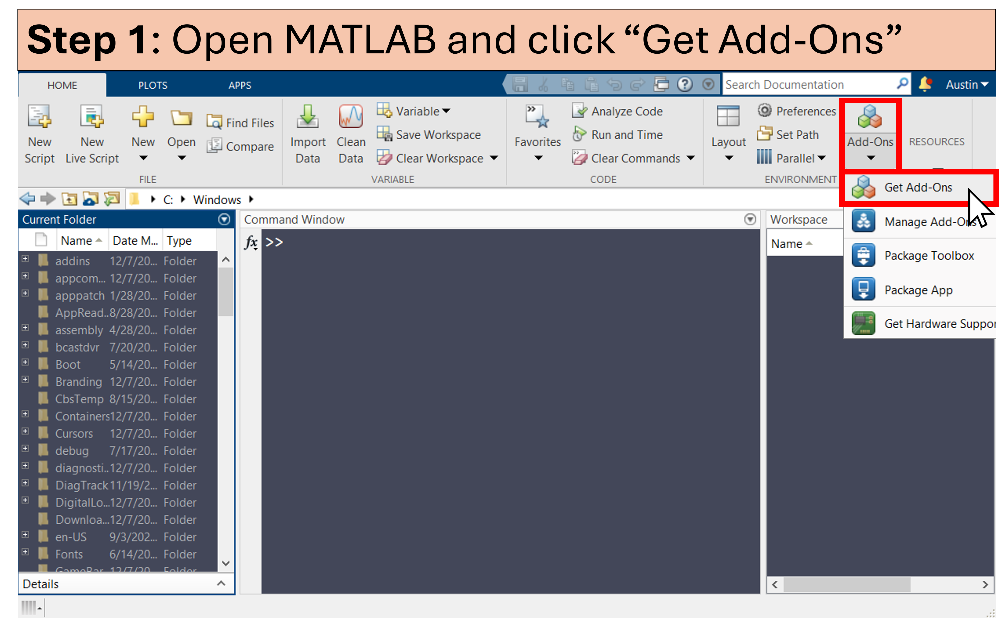
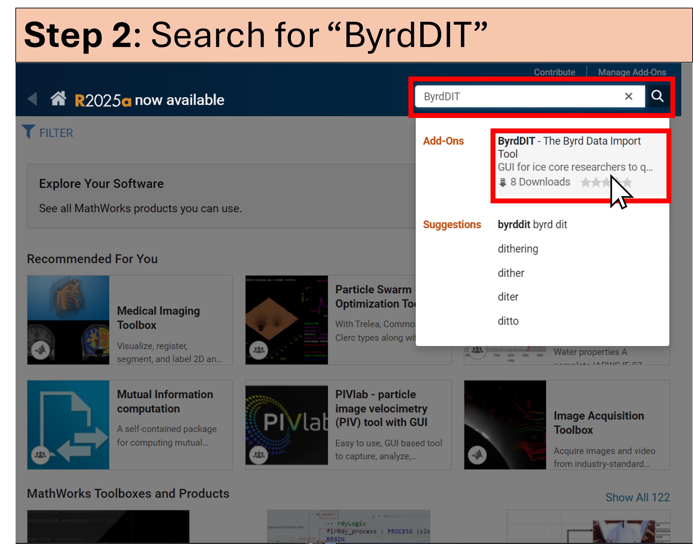
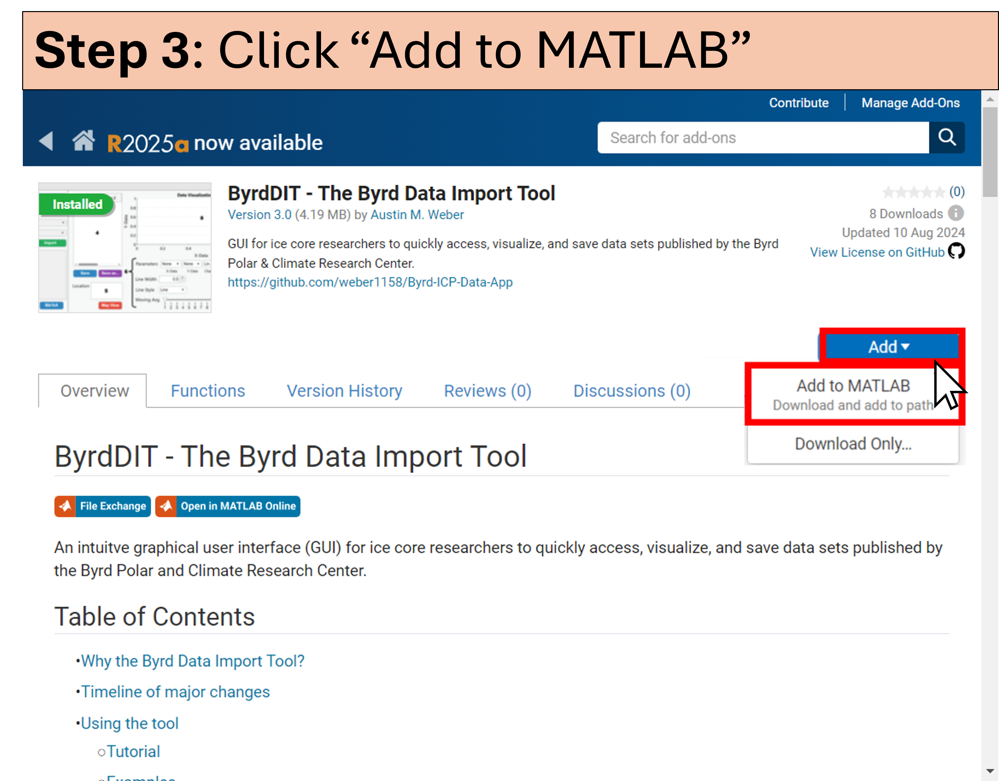

# 🛠 **Installation**
You have two main options for installing this repository:

## MATLAB Desktop
To download this repository onto your PC, follow the instructions in the screenshots below.

## MATLAB Online
1. Click [**here**](https://matlab.mathworks.com/open/fileexchange/v1?id=171139) to open this repository in MATLAB Online.

2. In the Command Window, type `pathtool` and hit enter. 

3. Once the PathTool Application opens, add the main ByrdDIT repository folder and its subfolders to the default path.

4. You can now open the ByrdDIT app by executing the `ByrdApp` command in the Command Window.